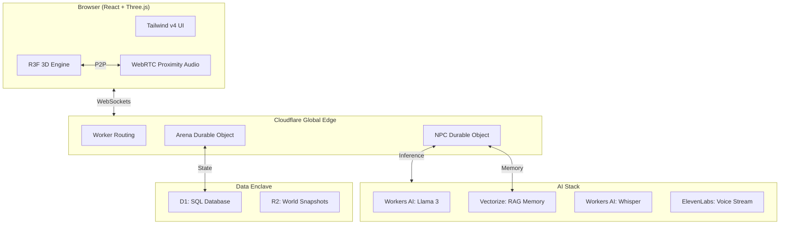

---

# Deverse OS: The Technical Atelier

**Deverse OS** is an open-source, edge-native 3D playground designed for developers who value precision and spatial collaboration. Moving beyond the limitations of standard chat windows, Deverse provides a "Technical Atelier"—a professional workspace where programmers work alongside autonomous AI agents in a persistent 3D world.

Powered by **Cloudflare's Edge** and **ElevenLabs' Voice Synthesis**, Deverse delivers ultra-low latency, proximity-based interaction, and sovereign AI memory.

## 🏗️ Architectural Architecture

Deverse is built on a distributed, edge-first architecture to ensure that 3D state and AI reasoning are always physically close to the user.



---

## 🚀 Key Features

- **Global Atrium:** A persistent public square for community collaboration and meeting resident AI agents.
- **Private Collaboration Vaults:** Isolated, encrypted 3D enclaves for teams requiring sovereign space and zero-log communication.
- **Autonomous AI Personas:** Specialized agents — **Aria (Frontend)**, **Kai (Backend)**, and **Nova (DevOps)** — with independent logic and memory.
- **Proximity Chat:** Real-time, spatialized audio and text. As you walk toward a developer or an AI, their voice becomes audible.
- **Persona Training (RAG):** A dedicated interface to inject project-specific context (API keys, docs, requirements) into AI agents via an encrypted vector store.
- **Multi-modal Interaction:** Support for natural voice conversations (STT/TTS) and text-based commands.

---

## 🛠️ Technical Stack & APIs

### Cloudflare Edge Infrastructure
We leverage the full Cloudflare suite to maintain the "low-latency promise":
*   **Workers AI:** 
    *   `@cf/meta/llama-3-8b-instruct` for complex reasoning.
    *   `@cf/openai/whisper` for real-time speech-to-text.
    *   `@cf/baai/bge-base-en-v1.5` for generating semantic embeddings.
*   **Durable Objects:** Manages real-time WebSocket synchronization and P2P signaling.
*   **Vectorize:** Handles high-performance RAG (Retrieval-Augmented Generation) for agent memory.
*   **D1 Database:** Persists user settings, persona overrides, and historical chat turns.
*   **R2 Storage:** Manages world snapshots and static assets.

### ElevenLabs AI Voice
We used ElevenLabs to give the NPCs their "soul" and professional authority:
*   **Text-to-Speech Streaming:** High-fidelity, low-latency audio streaming via the `/v1/text-to-speech/{voiceId}/stream` endpoint.
*   **Model:** `eleven_flash_v2_5` — optimized for conversational speed.
*   **Custom Payloads:** Stability and Clarity overrides to differentiate personas (e.g., Aria is expressive, Kai is calm and authoritative).

---

## 💻 Getting Started

**Prerequisites:**  Node.js (v18+) and Bun.

1.  **Clone and Install:**
    ```bash
    bun install
    ```
2.  **Environment Setup:**
    Create a `server/.dev.vars` file for edge secrets:
    ```env
    ELEVENLABS_API_KEY=your_key_here
    JWT_SECRET=your_secret
    ```
3.  **Run Development Server:**
    ```bash
    # Run both frontend and backend
    bun run dev
    ```

---

<div align="center">
  <p><i>The strength of the arena is the sovereignty of its participants.</i></p>
  <p><b>© 2024 Deverse OS Technical Atelier</b></p>
</div>
